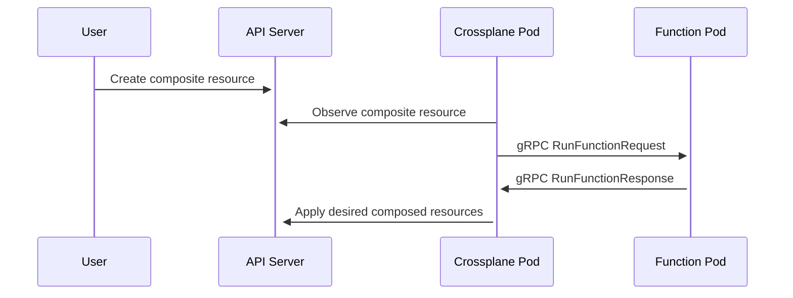

Composition 函数（简称函数）是模板化 crossplane 资源的自定义程序。 在创建复合资源（XR）时，crossplane 会调用 composition 函数来决定应创建哪些资源。 你可以使用 Go 或 Python 等通用编程语言编写函数来模板化资源。 使用通用编程语言可以让函数使用更高级的逻辑来模板化资源，如循环和条件。

您可以使用 Go 或 Python 等通用编程语言构建一个函数。 crossplane 社区还构建了一些函数，让您使用 [CUE](https://cuelang.org)、类似 helm 的 [Go 模板](https://pkg.go.dev/text/template) 或 [Patch and Transforms]().

## 安装 Composition 功能

安装功能会创建一个功能 pod。 Crossplane 会向该 pod 发送请求，询问它在创建 Composition 资源时要创建哪些资源。

使用crossplane安装功能功能对象设置spec.packages值为功能包的位置。

例如，安装 [Function Patch and Transform](https://github.com/crossplane-contrib/function-patch-and-transform)、

```yaml {label="install"}
apiVersion: pkg.crossplane.io/v1beta1
kind: Function
metadata:
  name: function-patch-and-transform
spec:
  package: xpkg.upbound.io/crossplane-contrib/function-patch-and-transform:v0.1.4
```

函数是 crossplane 软件包，有关软件包的更多信息，请参阅[软件包文档]().

默认情况下，Function pod 安装在与 crossplane 相同的 namespace (`crossplane-system`)。

## 验证一个 Composition 函数

使用 `kubectl get functions` 查看函数的状态

在安装过程中，函数将 `INSTALLED` 报告为 `True`，将 `HEALTHY` 报告为 `Unknown`。

```shell {copy-lines="1"}
kubectl get functions
NAME INSTALLED HEALTHY PACKAGE AGE
function-patch-and-transform True Unknown xpkg.upbound.io/crossplane-contrib/function-patch-and-transform:v0.1.4 10s
```

功能安装完成并被引用后，"HEALTHY "状态将报告为 "True"。

## 在 Composition 中被引用函数

当你创建一个复合资源时，crossplane 会调用一个 Function 来确定它应该创建哪些资源；当你更新或删除一个复合资源时，该 Function 还会告诉 crossplane 如何处理这些资源。

当 crossplane 调用函数时，它会将复合资源的当前状态发送给函数，同时也会将复合资源拥有的任何托管资源的当前状态发送给函数。

crossplane 通过查看复合资源所引用的 Composition，知道当复合资源发生变化时应调用哪个 Function。

crossplane 有四个核心组件，用户通常会把它们混为一谈: 

* [Composition]() - 用于定义如何创建资源的模板。
* [复合资源定义]() (`XRD`) - 一种自定义 API 规范。
* [复合资源]() (`XR`) - 使用 CompositeResourceDefinition 中定义的自定义 API 创建。XRs 使用 Composition 模板来创建新的托管资源。
* [声称]() (`XRC`) - 类似于 Composite Resource，但具有名称空间范围。



要使用合成功能，请设置合成模式为Pipelines.

定义一个 Pipelines的步骤。每个步骤都会调用一个函数。

每个 步骤被引用一个函数来引用名称的名称。

被引用的构成 模式: Pipelines不能使用 `resources` 字段指定资源模板。

使用功能 "修补和转换 "创建资源模板。

某些函数还允许您指定一个输入。函数定义了输入输入。

本例使用 [功能修补和转换](https://github.com/crossplane-contrib/function-patch-and-transform)。 功能修补和转换实现了 crossplane 资源模板。 输入类型为 资源，并接受 [Patch and Transform]()资源作为输入。

```yaml {label="single",copy-lines="none"}
apiVersion: apiextensions.crossplane.io/v1
kind: Composition
# Removed for Brevity
spec:
  # Removed for Brevity
  mode: Pipeline
  pipeline:
  - step: patch-and-transform
    functionRef:
      name: function-patch-and-transform
    input:
      apiVersion: pt.fn.crossplane.io/v1beta1
      kind: Resources
      resources:
      - name: storage-bucket
        base:
          apiVersion: s3.aws.upbound.io/v1beta1
          kind: Bucket
          spec:
            forProvider:
              region: "us-east-2"
```

## 在 Composition 中被引用函数的 Pipelines

当复合资源发生变化时，Crossplane 可以询问一个以上的 Function 做什么。 当一个 Composition 有两个或更多步骤的流水线时，Crossplane 会调用所有步骤。 它会按照它们在流水线中出现的顺序调用它们。

Crossplane 将前一个函数的结果传递给流水线中的每一个函数，从而实现了强大的函数组合。 在这个例子中，Crossplane 调用了 函数-提示创建一个 S3 存储桶，然后将该存储桶传递给函数-自动就绪，当桶就绪时，它会将 Composition 资源标记为就绪。

```yaml {label="double",copy-lines="none"}
apiVersion: apiextensions.crossplane.io/v1
kind: Composition
# Removed for Brevity
spec:
  # Removed for Brevity
  mode: Pipeline
  pipeline:
  - step: cue-export-resources
    functionRef:
      name: function-cue
    input:
      apiVersion: cue.fn.crossplane.io/v1beta1
      kind: CUEInput
      name: storage-bucket
      export:
        target: Resources
        value: |
          apiVersion: "s3.aws.upbound.io/v1beta1"
          kind: "Bucket"
          spec: forProvider: region: "us-east-2"
  - step: automatically-detect-readiness
    functionRef:
      name: function-auto-ready
```

## 测试被引用函数的 Composition

你可以使用 Crossplane CLI 预览任何使用 Composition 函数的 Composition 的 Output。 你不需要 Crossplane 控制平面就可以做到这一点。 Crossplane CLI 使用 Docker Engine 来运行函数。

请参阅 [Crossplane CLI docs]() 了解如何安装和被引用 crossplane CLI。

运行 `crossplane beta render` 需要 [Docker](https://www.docker.com)。

提供合成资源、合成和合成函数，以便在本地渲染输出。

```shell
crossplane beta render xr.yaml composition.yaml functions.yaml
```

`crossplane beta render` 将资源以 YAML 格式打印到 stdout。 它首先打印 Composition 资源，然后打印组合函数创建的资源。

```yaml
---
apiVersion: example.crossplane.io/v1
kind: XBucket
metadata:
  name: example-render
---
apiVersion: s3.aws.upbound.io/v1beta1
kind: Bucket
metadata:
  annotations:
    crossplane.io/composition-resource-name: storage-bucket
  generateName: example-render-
  labels:
    crossplane.io/composite: example-render
  ownerReferences:
  - apiVersion: example.crossplane.io/v1
    blockOwnerDeletion: true
    controller: true
    kind: XBucket
    name: example-render
    uid: ""
spec:
  forProvider:
    region: us-east-2
```



您可以使用这些文件，通过运行 `crossplane beta render` 重现下面的输出结果。

XR.yaml` 文件包含要渲染的 Composition 资源: 

```yaml
apiVersion: example.crossplane.io/v1
kind: XBucket
metadata:
  name: example-render
spec:
  bucketRegion: us-east-2
```

composition.yaml` 文件包含用于渲染复合资源的 Composition: 

```yaml
apiVersion: apiextensions.crossplane.io/v1
kind: Composition
metadata:
  name: example-render
spec:
  compositeTypeRef:
    apiVersion: example.crossplane.io/v1
    kind: XBucket
  mode: Pipeline
  pipeline:
  - step: patch-and-transform
    functionRef:
      name: function-patch-and-transform
    input:
      apiVersion: pt.fn.crossplane.io/v1beta1
      kind: Resources
      resources:
      - name: storage-bucket
        base:
          apiVersion: s3.aws.upbound.io/v1beta1
          kind: Bucket
        patches:
        - type: FromCompositeFieldPath
          fromFieldPath: spec.bucketRegion
          toFieldPath: spec.forProvider.region
```

functions.yaml` 文件包含 Composition 在其 Pipelines 步骤中引用的函数: 

```yaml
---
apiVersion: pkg.crossplane.io/v1beta1
kind: Function
metadata:
  name: function-patch-and-transform
spec:
  package: xpkg.upbound.io/crossplane-contrib/function-patch-and-transform:v0.1.4
```



Crossplane CLI 使用 Docker Engine 来运行函数。 你可以通过在 `functions.yaml` 中添加注解来改变 Crossplane CLI 运行函数的方式。 在函数中添加 `render.crossplane.io/runtime` 注解来改变函数的运行方式。

`crossplane beta render` 支持两个 `render.crossplane.io/runtime` 值: 

* `Docker`（默认）连接到 Docker 引擎。它使用 docker 拉取并运行函数运行时。
* 开发 "连接到手动运行的函数运行时。

当您被引用到 开发运行时，crossplane CLI 会忽略函数的 packages。相反，它希望你确保函数监听的是 localhost 端口 9443。 函数监听时必须不使用 gRPC 传输安全机制。 大多数函数 SDK 都允许你使用 `--insecure` flag 运行函数，以禁用传输安全机制。 例如，你可以使用 `go run . --insecure` 在本地运行 Go 函数。

```yaml {label="development"}
apiVersion: pkg.crossplane.io/v1beta1
kind: Function
metadata:
  name: function-patch-and-transform
  annotation:
    render.crossplane.io/runtime: Development
spec:
  package: xpkg.upbound.io/crossplane-contrib/function-patch-and-transform:v0.1.4
```

在[编写 Composition 函数](#write-a-composition-function)时，使用 "开发 "运行时来端到端测试您的函数。

`crossplane beta render` 还支持以下函数注解。 这些注解会影响它运行函数的方式: 

* `render.crossplane.io/runtime-docker-cleanup` - 当使用 `Docker` 时

runtime 这个注解指定 CLI 在调用函数后是否应停止函数容器。 它支持的 Values 有`Stop`（停止容器）和`Orphan`（让容器继续运行）。

* `render.crossplane.io/runtime-docker-pull-policy` - 当使用 `Docker` 运行时时，该注解指定 CLI 应在何时拉取函数的 package。它支持 Values `Always`、`Never` 和 `IfNotPresent`。
* `render.crossplane.io/runtime-development-target` - 当使用 `Development` 运行时，该注解会告诉 CLI 连接到在指定目标运行的 Function。它被引用[gRPC 目标语法](https://github.com/grpc/grpc/blob/v1.59.1/doc/naming.md)。

## 写一个 Composition 函数

Composition 函数可让您用自己选择的编程语言编写的代码取代复杂的 Composition。 Crossplane 提供各种工具、软件开发工具包（SDK）和模板，帮助您编写函数。

<!-- vale write-good.Passive = NO -->

下面是一个小巧的 hello world 函数示例。这个示例是用 [Go](https://go.dev) 编写的。

<!-- vale write-good.Passive = YES -->

```go
func (f *Function) RunFunction(_ context.Context, req *fnv1beta1.RunFunctionRequest) (*fnv1beta1.RunFunctionResponse, error) {
        rsp := response.To(req, response.DefaultTTL)
        response.Normal(rsp, "Hello world!")
        return rsp, nil
}
```

有些人设计的 Composition 功能可以被任何类型的合成资源引用。[Function Patch and Transform](https://github.com/crossplane-contrib/function-patch-and-transform) 和 [Function Auto Ready](https://github.com/crossplane-contrib/function-auto-ready)可以被任何类型的合成资源引用。

另一种常见的模式是为一种复合资源编写一个特定的 Composition 函数。 该函数包含在创建复合资源时告诉 crossplane 要创建哪些资源所需的所有逻辑。 当你编写这样的 Composition 函数时，你的 Composition 可以很小。 它只是告诉 crossplane 在你创建、更新或删除复合资源时要运行什么函数。

该 Composition 命令 crossplane 调用 function-xr-xbucket函数。 XBucketfunction-xr-xbucket "是硬编码，用于处理 "XBucket "复合资源。

```yaml {label="dedicated"}
apiVersion: apiextensions.crossplane.io/v1
kind: Composition
metadata:
  name: example-bucket-function
spec:
  compositeTypeRef:
    apiVersion: example.crossplane.io/v1
    kind: XBucket
  mode: Pipeline
  pipeline:
  - step: handle-xbucket-xr
    functionRef:
      name: function-xr-xbucket
```

要写好作文函数，你: 

1.从模板中创建函数。
2.编辑模板，添加函数逻辑。
3.[测试函数](#test-a-composition-that-uses-functions)。
4.构建函数，并将其推送到 packages 注册表。

您可以使用 [Crossplane CLI]()来创建、测试、构建和推送函数。 例如

```shell {copy-lines=none}
# Create the function from a template.
crossplane beta xpkg init function-example function-template-go
Initialized package "function-example" in directory "/home/negz/control/negz/function-example" from https://github.com/crossplane/function-template-go/tree/91a1a5eed21964ff98966d72cc6db6f089ad63f4 (main)

$ ls
Dockerfile fn.go fn_test.go go.mod go.sum input LICENSE main.go package README.md renovate.json

# Edit the template to add your function's logic
$ vim fn.go

# Build the function.
$ docker build . --quiet --tag runtime
sha256:2c31b0f7a34b34ba5b0b2dacc94c360d18aca1b99f56ca4f40a1f26535a7c1c4

# Package the function.
$ crossplane xpkg build -f package --embed-runtime-image=runtime

# Test the function.
$ go run . --insecure
$ crossplane beta render xr.yaml composition.yaml functions.yaml

# Push the function package to xpkg.upbound.io.
$ crossplane xpkg push -f package/*.xpkg crossplane-contrib/function-example:v0.1.0
```

crossplane 有[特定语言指南](更详细的函数编写指南，请参考您首选语言的指南。

在编写 Composition 函数时，了解 Composition 函数的工作原理是非常有用的。 请阅读下一节内容，了解[Composition 函数的工作原理](#how-composition-functions-work)。

## Composition 函数如何工作

每个 Composition 函数实际上都是一个[gRPC](https://grpc.io) 服务器。gRPC 是一个高性能、开源的远程过程调用（RPC）框架。当你[安装一个函数](#install-a-composition-function) 时，crossplane 会将该函数部署为 gRPC 服务器。 Crossplane 会对所有 gRPC 通信进行加密和验证。

你不必成为 gRPC 专家也能编写函数。 Crossplane 的函数 SDK 会为你设置 gRPC。 不过，了解 Crossplane 如何调用你的函数，以及你的函数应该如何响应是很有用的。



当您创建、更新或删除使用 Composition 函数的复合资源时，crossplane 会按照这些函数在 Composition 管道中出现的顺序调用它们。 Crossplane 通过向每个函数发送 gRPC RunFunctionRequest 来调用它们。 该函数必须以 gRPC RunFunctionResponse 进行响应。

您可以在 [Buf Schema Registry](https://buf.build/crossplane/crossplane/docs/main:apiextensions.fn.proto.v1beta1) 中找到 RunFunctionRequest 和 RunFunctionResponse RPC 的详细模式。

当 crossplane 调用函数时，它会在 RunFunctionRequest 中包含四项重要内容。

1.Composition 资源和任何组成资源的**观测状态**。
2.复合资源和任何组成资源的**期望状态。
3.函数的**输入。
4.函数 Pipelines 的**上下文**。

函数的主要工作是更新**期望状态**并将其返回给 crossplane。 它通过返回 RunFunctionResponse 来实现这一目标。

大多数 Composition 函数都会读取所观察到的复合资源状态，并利用它将组成资源添加到所需状态。 这就告诉了 crossplane 它应该创建或更新哪些组成资源。



<!-- vale write-good.Weasel = NO -->

<!-- Disable Weasel to say "usually", which is correct in this context. -->

Composition 资源是由复合资源创建的资源。 复合资源通常是 crossplane 受管资源（MR），但也可以是任何类型的 crossplane 资源。 例如，复合资源也可以创建 ProviderConfig 或其他类型的复合资源。

<!-- vale write-good.Weasel = YES -->



#### 观察到的状态

当你创建像这样的 Composition 资源时，crossplane 会观察到它，并将其作为观察状态的一部分发送给 Composition 函数。

```yaml
apiVersion: example.crossplane.io/v1
kind: XBucket
metadata:
  name: example-render
spec:
  bucketRegion: us-east-2
```

如果已经存在任何组成资源，crossplane 会对其进行观察，并将其作为观察状态的一部分发送给您的函数。

crossplane 还会观察您的 Composition 资源和任何组成资源的连接详情，并将其作为观察状态的一部分发送给您的函数。

Crossplane 在开始调用 Pipelines 中的函数之前，会对 Composition 资源和任何组成资源进行一次观测。 这意味着，Crossplane 会向 Pipelines 中的每个函数发送相同的观测状态。

#### 期望状态

期望状态是函数 Pipelines 希望对 Composition 资源和任何组成资源进行更改的集合。 当函数将组成资源添加到期望状态时，crossplane 就会创建这些资源。

功能可以改变: 

* Composition 资源的 "状态"。
* 任何合成资源的 "元数据 "和 "规格"。

函数还可以更改 Composition 资源的连接详情和就绪状态。 函数通过告诉 Crossplane 其组成资源是否就绪来表明 Composition 资源已就绪。 当函数管道告诉 Crossplane 所有组成资源都已就绪时，Crossplane 就会将 Composition 资源标记为就绪。

函数不能改变: 

* 合成资源的 `metadata` 或 `spec`。
* 任何合成资源的 "状态"。
* 任何合成资源的连接详情。

一个由多个函数组成的流水线会积累所需的状态，这意味着每个函数都是建立在流水线中之前函数的所需状态之上。 Crossplane 会向一个函数发送流水线中之前所有函数积累的所需状态。 该函数会添加或更新所需的状态，然后将其传递下去。 当流水线中的最后一个函数运行完毕后，Crossplane 就会应用其返回的所需状态。

函数***必须***将其 RunFunctionRequest 中的所有所需状态复制到其 RunFunctionResponse 中。 如果函数在其所需状态中添加了资源，则下一个函数必须将其复制到所需的状态中。 如果没有，则 crossplane 不会应用该资源。 如果该资源存在，则 crossplane 会将其删除。

函数可以有意选择不复制所需的部分状态，例如，函数可以选择不复制所需的资源，以防止该资源的存在。

大多数功能 SDK 都会自动复制所需的状态。

函数只应将它所关心的字段添加到所需的状态中。 每次 crossplane 调用它时，它都应添加这些字段。 如果函数将某个字段添加到所需的状态中一次，但在下次调用时没有添加，则 crossplane 会删除该字段。 组成资源也是如此。 如果函数将某个组成资源添加到所需的状态中，但在下次调用时没有添加，则 crossplane 会删除该组成资源。

crossplane 使用[服务器端引用](https://kubernetes.io/docs/reference/using-api/server-side-apply/)来引用函数 Pipelines 返回的所需状态。在服务器端引用术语中，所需的状态是_完全指定的意图_。

例如，如果函数只想确保区域 `us-east-2` 中的 S3 bucket 存在，它就应该将此资源添加到所需的组成资源中。

```yaml
apiVersion: s3.aws.upbound.io/v1beta1
kind: Bucket
spec:
  forProvider:
    region: us-east-2
```

即使 Bucket 已经存在，并且有其他 `spec` 字段，或者有 `status`, `name`, `labels` 等字段，函数也应该省略它们。 函数应该只包含它有意见的字段。 crossplane 会应用函数关心的字段，将它们与现有的 Bucket 合并。

Composition 功能实际上并不使用 YAML 来引用所需的和观察到的资源。 本例使用 YAML 仅为说明目的。

### 功能输入

如果 Composition 包括 输入输入是为函数提供额外配置的有用方法。 支持输入是可选的，并非所有函数都支持输入。

```yaml {label="input",copy-lines="none"}
apiVersion: apiextensions.crossplane.io/v1
kind: Composition
metadata:
  name: example-render
spec:
  compositeTypeRef:
    apiVersion: example.crossplane.io/v1
    kind: XBucket
  mode: Pipeline
  pipeline:
  - step: patch-and-transform
    functionRef:
      name: function-patch-and-transform
    input:
      apiVersion: pt.fn.crossplane.io/v1beta1
      kind: Resources
      resources:
      - name: storage-bucket
        base:
          apiVersion: s3.aws.upbound.io/v1beta1
          kind: Bucket
        patches:
        - type: FromCompositeFieldPath
          fromFieldPath: spec.bucketRegion
          toFieldPath: spec.forProvider.region
```

crossplane 不会验证函数的输入，因此函数最好验证自己的输入。

#### 功能 Pipelines 上下文

有时，Pipelines 中的两个函数希望彼此共享非所需状态的信息。 为此，函数可以使用上下文。 任何函数都可以写入 Pipeline 上下文。 Crossplane 会将上下文传递给所有后续函数。 当 Crossplane 调用完所有函数后，它会丢弃 Pipeline 上下文。

Crossplane 也可以写入上下文。 如果启用 alpha [composition environment]() 功能，crossplane 就会将环境写入顶级上下文字段 `apiextensions.crossplane.io/environment`。

## 关闭组成功能

Crossplane 默认启用 Composition 函数。 使用 `helm install --args` 在 Crossplane 中禁用 beta 功能标志，即可禁用对 Composition 函数的支持。

```shell
helm install crossplane --namespace crossplane-system crossplane-stable/crossplane \
    --create-namespace \
    --set "args='{--enable-composition-functions=false}'"
```

前面的 Helm 命令在安装 crossplane 时禁用了 Composition 功能特性标志。 通过查找日志行确认是否禁用了 Composition 功能: 

```shell {copy-lines="1"}
kubectl -n crossplane-system logs -l app=crossplane
{"level":"info","ts":1674535093.36186,"logger":"crossplane","msg":"Beta feature enabled","flag":"EnableBetaCompositionFunctions"}
```

如果在 crossplane 启动时没有看到日志行，则表示已禁用了 Composition 功能。
